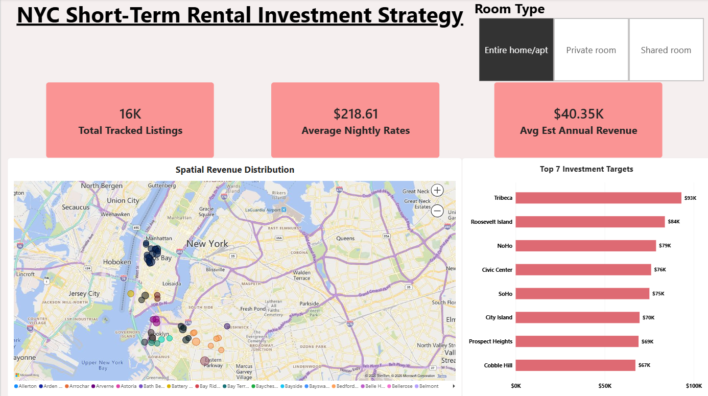

Markdown

# NYC Short-Term Rental Investment Strategy & Spatial Revenue Engine

## Strategic Objective
- **Commercial Intent:** Advise an institutional real estate investment firm on capital allocation for high-yield residential properties with the New York City short-term rental market.
- **Decision Deliverables:** identify the optimal asset classification ('room type'), sub-neighborhood for capital development, and benchmarked realistic annualized cash flow expectations.

## The Revenue Proxy Engine & Data Filtering Methodology
- **Annual Revenue Formulation:** Gross annual revenue per listing is estimated via the proxy equation:
$$\text{Estimated Annual Revenue} = \text{Price} \times (365 - \text{Availability\_365}) $$
- **Boundary Anomaly Purge:**
- **'availability_365 = 0':** This purges delisted properties, regulatory locks, and dormant accounts that artificially drag down our averages.
- **'availability_365 = 365':** Purged to remove abandoned calendar properties, which demonstrate zero consumer demand.
- **'price = 0':** This criterion should be removed to eliminate system testing records and bookkeeping errors.
- **Statistical Significance Threshold:** Micro-neighborhoods with fewer than 50 active listings were filtered out to eliminate low sample properties.

## Core Investment Recommendations
- **Target Asset Class:** Allocate 100% of acquisition capital to entire home/apt inventory. These units generate more than twice the annual revenue of private room alternatives and capture business traveler demand.
- **Target Micro-Market:** Allocate capital in properties in Tribeca (Manhattan) as the primary target; consider its second alternative in Roosevelt Island and Noho.
- **Financial Expectations:** Expect average annual revenue in Tribeca around $93,000+ at average nightly rates exceeding $513, supported by stable booking velocity.
## Executive Dashboard Preview

